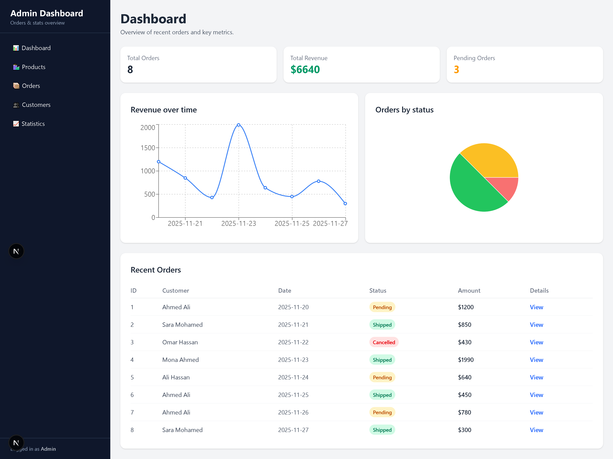
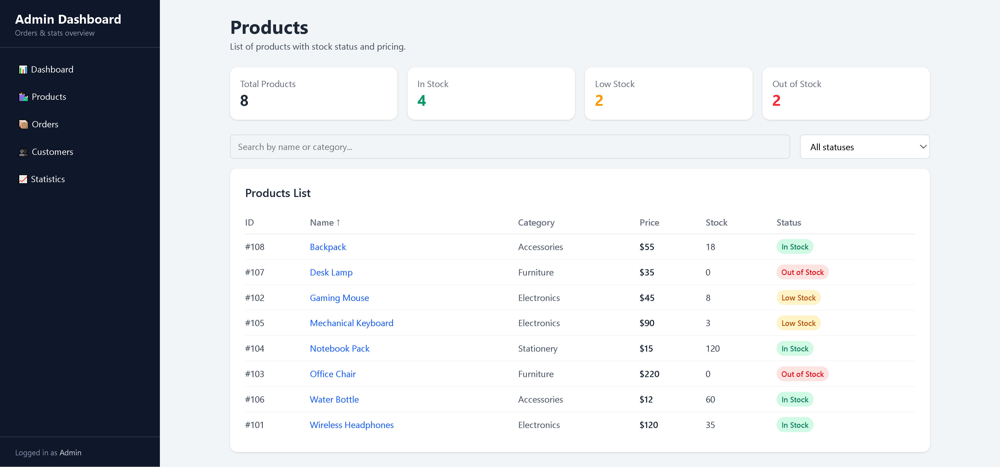
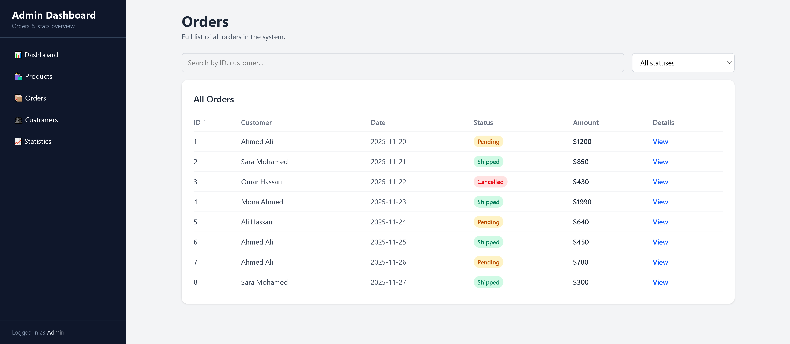
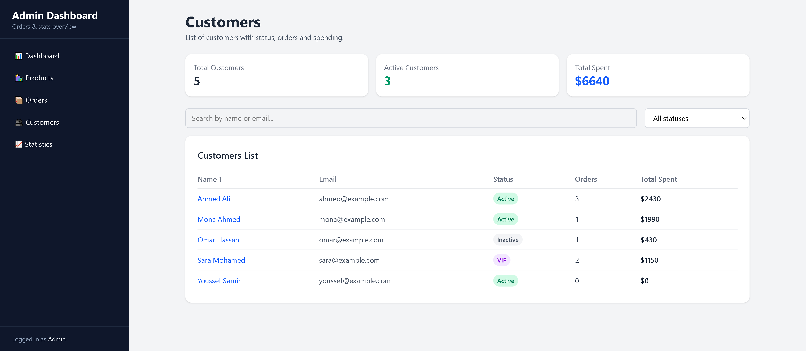
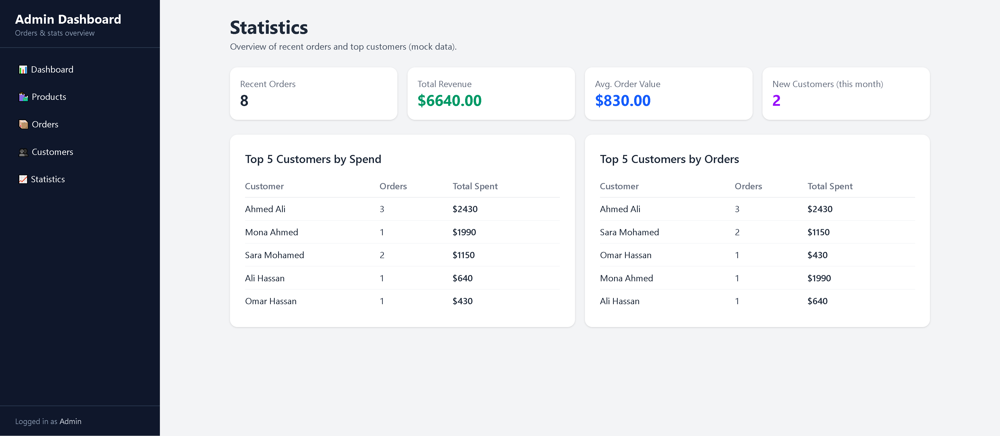
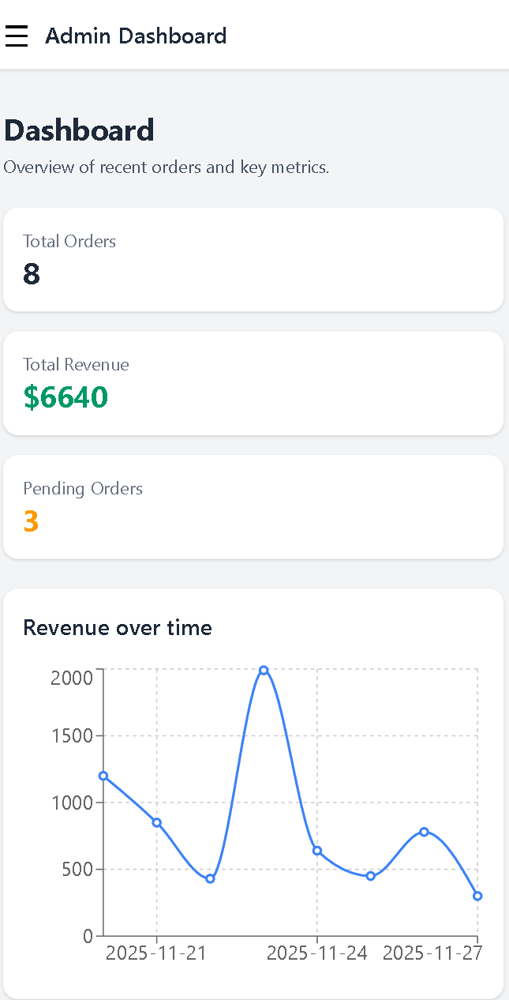
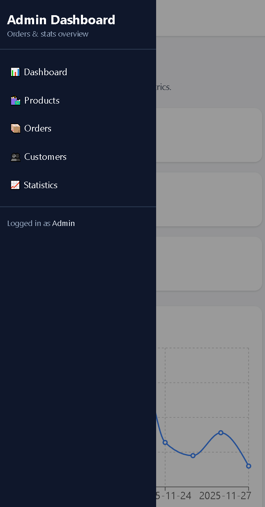

# 📊 Admin Dashboard — Orders, Customers & Products


A modern **Admin Dashboard** built with **Next.js (App Router)**, **React**, **TypeScript** and **Tailwind CSS**.

Includes pages for **Dashboard**, **Orders**, **Customers**, **Products**, and **Stats** with search, filters, sorting and charts — using static mock data (no backend).

---

## 🚀 Features

### 🧭 Layout & Navigation
- Persistent desktop sidebar with:
  - Dashboard
  - Orders
  - Customers
  - Products
  - Statistics
- Responsive navigation with an off-canvas, toggleable sidebar on mobile viewports

---

### 📊 Dashboard (Overview)
- Summary cards:
  - Total Orders
  - Total Revenue
  - Pending Orders
- Line chart: **Revenue per day**
- Pie chart: **Orders by status**
- Recent orders table with status badges

---

### 📦 Orders Page
- Full orders list
- Search by:
  - Order ID
  - Customer name
- Filter by **status** (Pending / Shipped / Cancelled)
- Sorting:
  - ID (asc/desc)
  - Date (asc/desc)
  - Amount (asc/desc)
- Link to **Order details** page `/orders/[id]`

---

### 👥 Customers Page
- Summary cards:
  - Total customers
  - Active customers
  - Total spent (all customers)
- Search by **name** or **email**
- Filter by status (Active / VIP / Inactive)
- Sorting:
  - Name (A–Z / Z–A)
  - Total spent (asc/desc)
- Customers table with status badges
- Customer details page `/customers/[id]` showing:
  - Basic info
  - Status, total orders, total spent
  - Simple summary

---

### 🛒 Products Page
- Summary cards:
  - Total products
  - In stock
  - Low stock
  - Out of stock
- Search by **name** or **category**
- Filter by **stock status**
- Sorting:
  - Name (A–Z / Z–A)
  - Price (asc/desc)
- Products table with:
  - ID, name, category, price, stock, status badge
- Product details page `/products/[id]`

---

### 📈 Statistics Page
- Global KPIs:
  - Total orders
  - Total revenue
  - Average order value
  - New customers this month
- Top 5 customers by **total spent**
- Top 5 customers by **number of orders**

---

## 🧱 Project Structure & Architecture

The project follows the Next.js App Router structure with a clear separation of concerns.

- `app/` — Pages, routing, and layouts.
- `components/` — Reusable UI components shared across multiple pages.
- `lib/` — Business logic and reusable data calculations.
- `data/` — Mock data used across the application.
- `public/` — Static assets and screenshots.

Key architectural decisions:
- Business logic is separated from UI components to improve readability and maintainability.
- Components and utilities are extracted only when reuse is necessary to avoid over-engineering.
- Page-specific logic remains inside the page when it does not need to be shared.

---

## 🧠 What I Focused On

- Writing clean, readable, and maintainable code.
- Separating business logic from UI components to improve scalability and clarity.
- Avoiding over-engineering by extracting components and logic only when reuse was necessary.
- Handling edge cases such as empty states, invalid routes, and missing data.
- Keeping a consistent UI and UX across all dashboard pages.

---

## 🛠 Tech Stack

- **Next.js**
- **React**
- **TypeScript**
- **Tailwind CSS**
- Mock data stored locally in `data/` folder (no backend)

---

## 📸 Screenshots
### 📊 Dashboard Overview


### 🛍 Products


### 📦 Orders Management


### 👥 Customers


### 📈 Statistics


---

### 📱 Mobile Views

### 📊 Dashboard (Mobile)


### ☰ Mobile Sidebar (Off-canvas)


## ▶️ Run Locally

```bash
git clone https://github.com/ahmadashraf7x/nextjs-admin-dashboard.git
cd nextjs-admin-dashboard
npm install
npm run dev
```

### 🌍 Live Demo 

🚀 https://nextjs-admin-dashboard-blush.vercel.app

---

### 📌 Author
**Ahmad Ashraf**

Front-End Developer